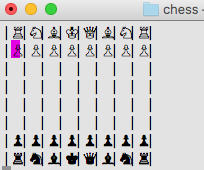

# **Chess Club**

_A command-line interpretation of the classic game for the brain_

Arrow keys to move, space or enter to select and move

## Setup
Clone this git, navigate to the /chess directory, and run 'ruby game.rb'

## Features
Your typical chess game, complete with en passant. Try it out!

More to come...
